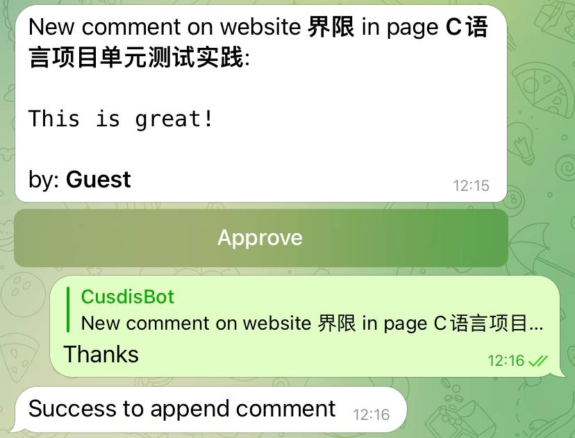

# cusdis-telegram-bot

Another telegram bot for [Cusdis](https://github.com/djyde/cusdis)

Inspied by offical Cusdis bot [cusdis-telegram-bot](https://github.com/djyde/cusdis-telegram-bot)

## Feature

Notice: these feature base on a redis server, we will automatically delete it after 1 and 2 action.

1. Approve comment in bot
2. Append comment in bot

## Usage

1. Open and start bot [@CusdisxBot](https://t.me/cusdisxbot)
2. Send `/gethook` command
3. Copy and paste the URL in Cusdis project's webhook settings